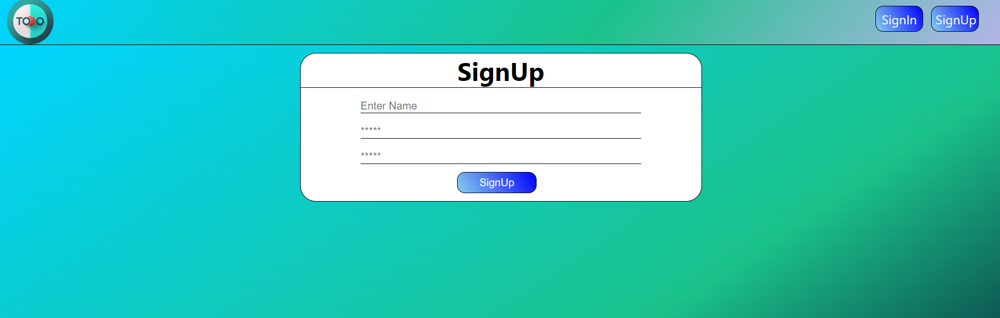
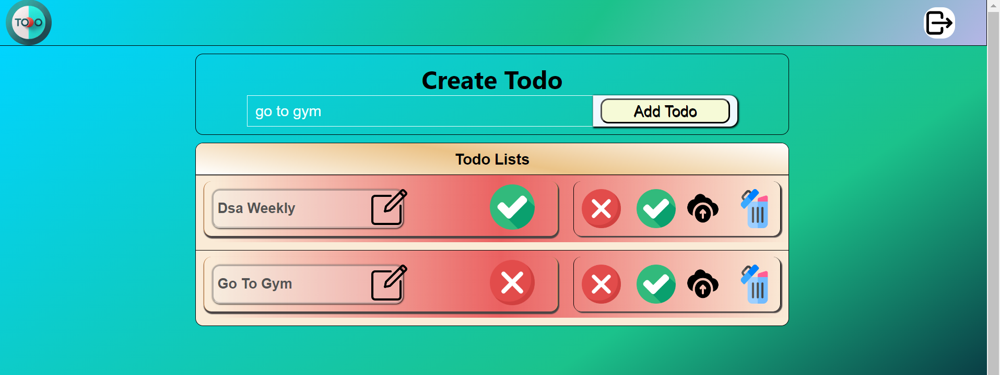

<!-- TO INSTALL THE DEPENDY  -->

#### 'npm i' OR 'npm install'

### `npm start`

Start the development server and run
You can see the Application on browser 'localhost:3000'

Thank you for Reading This.

I have put some Picutre for Your Reference!!!

Runs the app in the development mode.\

Open [http://localhost:3000](http://localhost:3000) to view it in your browser.

The page will reload when you make changes.\
You may also see any lint errors in the console.
